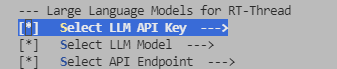
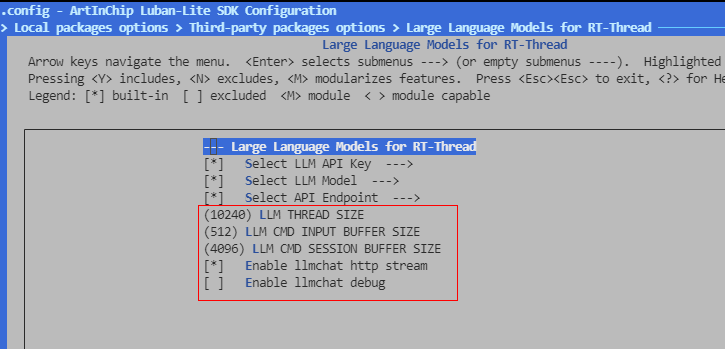
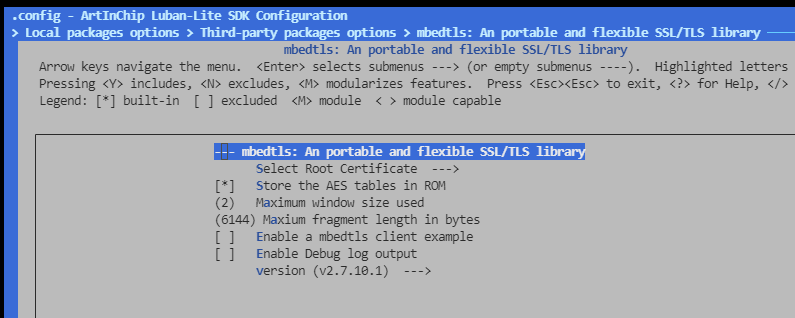
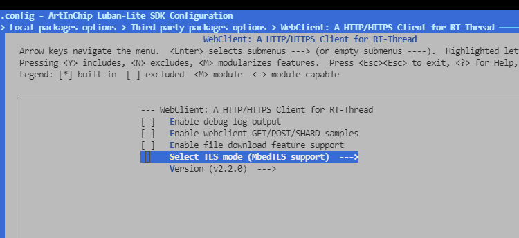
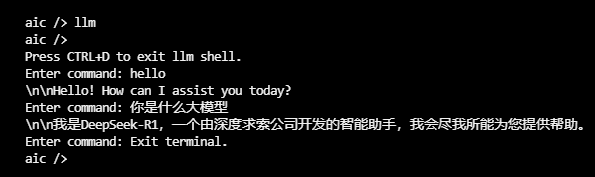

# LLM Language Model in RT-Thread

> 在 RT-Thread 上进行 LLM 大语言模型对话

## LLM平台

- [x] 通义千问
- [x] 豆包大模型
- [x] DeepSeek
- [x] 自定义的大模型

## 平台支持

- [x] qemu-a9

- [x] STM32

## 请求方式

- [x] Stream模式
- [x] 非Stream模式

## 使用方式

**首先确保您的设备可以使用正常使用网络功能**

### MSH终端交互

1. 打开 menuconfig，进入 `Local packages options → Third-party packages options → Large Language Models for RT-Thread` 目录下；
2. 选择要使用的 LLM 模型以及模型对应的API Key与API 的URL（这里支持选择默认的DeepSeek，豆包以及通义千问，也支持手动输入自己的API）：

5. 这里以自己所输入的大模型为例：输入此大模型网站获取到的 `API KEY` 和 `推理接入点URL` 以及模型的名称 `LLM MODEL` ,若使用默认的大模型则不需要输入；

​	配置信息说明：

* llm thread size：大模型线程栈大小
* llm cmd input buffer size：大模型输入字符大小
* webclient sessionbuffer size：客户端会话缓冲区
* Enable llmchat http stream：是否使能流式对话

6.   进入 `Local packages options → Third-party packages options → mbedtls` 菜单，修改 `Maxium fragment length in bytes` 字段为 6144（否则TLS会握手失败）

7. 进入 `  Local packages options → Third-party packages options → WebClient: A HTTP/HTTPS Client for RT-Thread` 选择`MbedTLS support`

8. 退出保存配置

9. 编译，运行；
10. 运行效果：

> 输入 llm 即可进入聊天终端，CTRL+D可以退出聊天窗口返回 MSH 终端；

